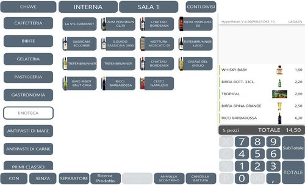
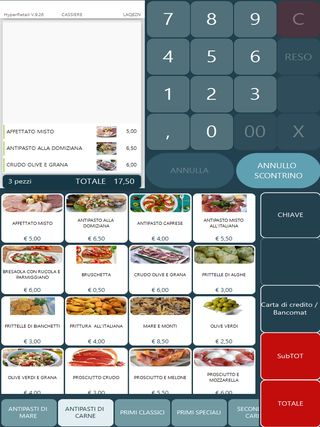
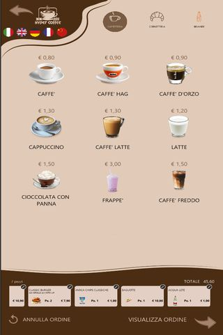
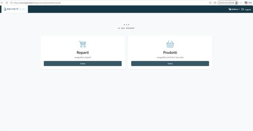
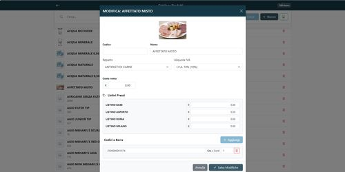
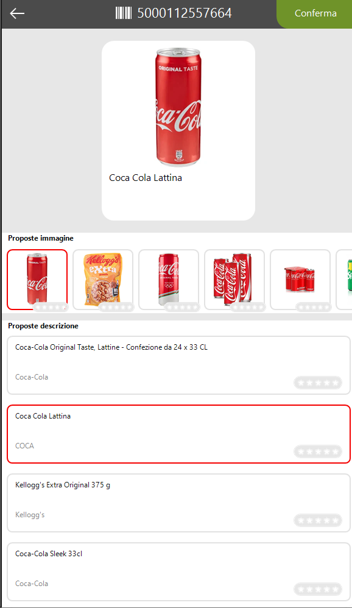

# Il Prodotto — HyperRetailCloud

**HyperRetailCloud — Formazione Commerciale** | *Custom S.p.A. © 2026*

---

HyperRetailCloud è un software di cassa potente, flessibile e cloud-native: combina un'interfaccia grafica avanzata e personalizzabile con un'architettura robusta che garantisce operatività continua, anche senza connessione a Internet.

---

## 1. Interfaccia di vendita grafica

Il cuore di HyperRetailCloud è la schermata di vendita interamente personalizzabile: tasti, colori, sfondi, immagini, layout — tutto configurabile in base alle esigenze specifiche di ogni esercente e settore merciologico.

### Cassa assistita con operatore

Per i punti vendita con operatore, l'interfaccia è semplice e immediata: pochi tasti grandi, chiari, colorati. Il personale trova subito quello che cerca senza navigare menu complessi.

{ align=right width=380 }

- **Tasti configurabili** — colore, icona, immagine prodotto, testo: ogni tasto è personalizzabile
- **Layout flessibile** — griglia liberamente organizzabile per reparto, categoria o funzione
- **Sfondo e grafica** — personalizzazione completa dell'aspetto visivo per rispecchiare il brand del cliente
- **Multipiattaforma** — si adatta a qualsiasi risoluzione, da PC touch a tablet Android

 

{ align=left width=230 }

Ogni tasto può mostrare la foto del prodotto, il nome e il prezzo — il personale seleziona con un tocco. Ideale per ristorazione, bar e locali con menu fotografico.

 

### Totem self-service e self-order

{ align=right width=220 }

Sul totem self-service HyperRetailCloud trasforma la schermata di vendita in una vera architettura di vendita guidata: il cliente viene accompagnato nel percorso d'acquisto attraverso immagini e video in altissima risoluzione che valorizzano i prodotti e stimolano l'acquisto.

!!! tip "Self-order: uno strumento di marketing attivo"
    Sul totem ogni schermata vende:

    - Immagini e video in altissima risoluzione per ogni prodotto o categoria
    - Percorsi guidati dalla scelta al pagamento
    - Upselling visivo: suggerimenti contestuali ("aggiungi un extra", "completa il pasto")
    - Personalizzazione totale: sfondo, loghi, colori, animazioni — il totem diventa un'estensione del brand

    Ideale per: fast food, bar, paninoteche, pizzerie d'asporto, gelaterie.

> *"Non è solo una cassa in piedi. È un venditore automatico che lavora 24/7, conosce il menu, spinge i prodotti giusti e non si stanca mai."*

 

---

## 2. Architettura offline-first: sempre operativo

HyperRetailCloud utilizza un database locale sul dispositivo che consente tutte le operazioni di vendita anche senza connessione a Internet. Quando la rete torna disponibile, il software sincronizza automaticamente i dati in modo bidirezionale con il cloud.

| Con connessione Internet | Senza connessione Internet |
|--------------------------|---------------------------|
| Dati sincronizzati in tempo reale | Il database locale garantisce vendita continua |
| Anagrafica aggiornata da remoto su tutti i device | Tutte le funzioni di cassa rimangono attive |
| Configurazioni e listini distribuiti istantaneamente | Al ripristino: sincronizzazione automatica bidirezionale |
| Accesso alla Web Console da qualsiasi browser | Nessuna perdita di dati, nessuna transazione persa |

!!! note "Perché offline-first è un argomento di vendita"
    Un punto vendita non può permettersi di fermarsi per un problema di rete. Con HyperRetailCloud, anche se la connessione cade, la cassa continua a lavorare normalmente. **Il cloud è un potenziamento, non una dipendenza.**

---

## 3. Tre modi per configurare HyperRetailCloud

HyperRetailCloud offre tre canali distinti per la configurazione, adatti a diversi livelli di utenza e contesti operativi.

### ① Direttamente dalla cassa

L'operatore accede alla sezione di configurazione dell'app e può modificare anagrafiche, listini e impostazioni di base direttamente dal dispositivo, senza strumenti aggiuntivi.

### ② HyperLand — l'applicazione del partner

HyperLand è l'applicazione esclusiva per i Partner Custom, il centro di controllo per gestione licenze, personalizzazione e abbinamento hardware. Da HyperLand il dealer può:

- **Personalizzare la schermata di vendita** — layout, tasti, colori, immagini, grafica
- **Gestire le anagrafiche prodotti** — inserimento, modifica, importazione
- **Gestire le licenze** — attivazione, rinnovo, controllo stato da remoto

!!! warning "Riservata ai Partner Custom"
    HyperLand è accessibile esclusivamente ai Partner Custom autorizzati. Il cliente finale non ha accesso diretto a questa applicazione.

### ③ Web Console — il portale del cliente finale

La Web Console è il portale web dedicato al cliente finale, accessibile da qualsiasi browser tramite l'indirizzo email abilitato in fase di installazione dal dealer.

{ align=right width=320 }

- **Accesso via browser** — nessun software da installare, basta una connessione Internet
- **Gestione archivi in autonomia** — il titolare aggiorna anagrafiche, prezzi e reparti senza chiamare il tecnico
- **Da qualsiasi dispositivo** — PC, tablet o smartphone: la Web Console si adatta a qualsiasi schermo
- **Accesso sicuro** — autenticazione via email configurata in fase di installazione

 

{ width=480 }

*La scheda articolo nella Web Console: reparto, IVA, listini differenziati (base, asporto, Roma, Milano...) e codice a barre — tutto gestito dal titolare in autonomia, senza il tecnico.*

---

## 4. Funzionalità incluse nel modulo base

Il modulo base di HyperRetailCloud include già funzionalità avanzate, senza acquisto di moduli aggiuntivi. I moduli settoriali Hyperetail possono essere aggiunti progressivamente per espandere le capacità in base al settore del cliente.

### Conti sospesi e gestione multi-conto

HyperRetailCloud consente di parcheggiare uno o più conti aperti e richiamarli in qualsiasi momento per l'emissione del documento telematico. Fondamentale per bar, tabaccherie e qualsiasi attività dove il cliente paga a fine servizio.

- **Sospensione conto** — il conto va in attesa senza bloccare la cassa: si apre un nuovo conto subito
- **Multi-conto simultaneo** — più conti aperti in parallelo, richiamabili in qualsiasi momento
- **Emissione documento** — si richiama il conto sospeso e si emette lo scontrino telematico in un tocco

### Stampa comanda contestuale

Anche senza il modulo ristorazione, HyperRetailCloud stampa la comanda in cucina o al banco in due modalità:

- **Alla sospensione del conto** — la comanda parte nel momento in cui il conto viene parcheggiato
- **In contemporanea all'emissione documento** — comanda e scontrino escono insieme al momento del pagamento

---

## 5. Anagrafica articoli: veloce, guidata e intelligente

La costruzione dell'anagrafica è guidata, rapida e assistita dal cloud: basta scansionare il barcode e il sistema fa il resto.

### Come funziona l'inserimento automatico

{ align=right width=280 }

1. **Scansiona il barcode** — l'operatore legge il codice con lo scanner
2. **Il cloud riconosce il prodotto** — HyperRetailCloud cerca nel database centralizzato
3. **Proposta automatica** — il sistema mostra descrizioni e immagini del prodotto
4. **L'operatore personalizza** — inserisce solo prezzo di vendita, prezzo di acquisto e reparto
5. **Articolo pronto** — in anagrafica in pochi secondi, con immagine inclusa

!!! success "Risultato"
    Un catalogo prodotti completo, con immagini, costruito in pochi minuti senza digitare nulla manualmente. Veloce e immediato anche per operatori senza esperienza informatica.

 

### Anagrafica tabacchi — richiede il modulo Monopolio

Per le tabaccherie, l'esercente non deve caricare le oltre 6.000 referenze del Monopolio. Carica solo i prodotti che vende effettivamente — e li trova già con prezzi e barcode aggiornati in automatico.

- **Anagrafica personalizzata** — solo i prodotti dell'esercente, non l'intero catalogo Monopolio
- **Aggiornamento prezzi automatico** — ogni variazione del Monopolio viene recepita in tempo reale, senza procedure manuali
- **Ideale per chi ha il patentino** — gestione semplice, snella e sempre aggiornata

---

## 6. Gestione codici alternativi e confezioni

HyperRetailCloud non ha limiti sul numero di barcode abbinabili allo stesso articolo. Una funzionalità che risolve esigenze concrete in più settori.

### Codici alternativi

- **Più barcode per lo stesso articolo** — il prodotto viene riconosciuto da qualsiasi codice associato
- **Tabacchi — aggiornamento automatico** — basta leggere un singolo EAN e HyperRetailCloud aggiunge automaticamente tutti i codici alternativi disponibili, comprese le stecche
- **Nessuna configurazione manuale** — il cloud distribuisce i codici alternativi in modo trasparente

### Gestione confezioni

La gestione delle confezioni consente di abbinare a un articolo una versione multiplo con un prezzo specifico, diverso dal prezzo del singolo.

- **Tabacchi — gestione stecche** — ogni stecca è collegata al singolo pacchetto; lo sfusamento aggiorna la giacenza automaticamente
- **General store — confezioni multiple** — il prezzo della confezione può essere diverso dal prezzo unitario
- **Flessibilità totale** — ogni articolo può avere più formati, ognuno con il proprio barcode e prezzo

---

## 7. Riepilogo funzionalità

| Area | Funzionalità |
|------|-------------|
| Interfaccia di vendita | Grafica personalizzabile: tasti, colori, sfondi, immagini, video |
| Totem self-service | Architettura di vendita guidata con media in alta risoluzione |
| Offline-first | DB locale + sincronizzazione cloud bidirezionale automatica |
| Configurazione | Da cassa, da HyperLand (dealer) o da Web Console (cliente finale) |
| Conti sospesi | Multi-conto in parallelo con emissione documento differita |
| Stampa comanda | Contestuale alla sospensione o all'emissione documento |
| Anagrafica guidata | Inserimento via barcode + cloud DB con immagini automatiche |
| Tabacchi | Solo i prodotti venduti, prezzi Monopolio aggiornati in real-time |
| Codici alternativi | Nessun limite di barcode per articolo, aggiornamento automatico |
| Confezioni | Gestione stecche e multipli con prezzi differenziati |

---

[← Contesto di Mercato](contesto_mercato.md) | [Successivo: I Piani →](i_piani.md)

*Custom S.p.A. © 2026 — Uso riservato ai concessionari autorizzati*
